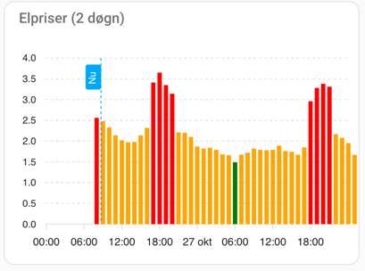
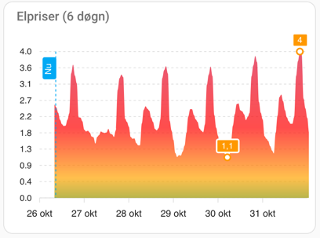

# Energy Manager [DK]

1. Add repository URL to Home Assistant Add-on store
2. Install the Add-on in Home Assistant
3. Configure the Add-on:
   - **Region** is mandatory
   - *Carnot Username* is required only if using Carnot.dk predictions
   - *Carnot ApiKey* is required only if using Carnot.dk predictions
   - *Eloverblik Token* is not used yet - but may soon replace tariff configuration
4. Spot price values are all created as `sensor.energy_manager_*`
5. Confirm the tariff levels in `config/energy_assistant/tariffconfig.json` (recommend using Studio Code Server to edit it)
5. Configure spot price levels in `config/energy_assistant/spotpricelevels.json` (recommend using Studio Code Server to edit it)
6. To add some graphs using ApexCharts (from HACS) see below

## Spot Price Level

Found in `config/energy_assistant/spotpricelevels.json`

These are the defaults:
```json
{
  "free": 0.0,
  "cheap": 0.5,
  "normal": 1.5,
  "expensive": 2.5,
  "extreme": 4.0
}
```

## Tariffs

Found in `config/energy_assistant/tariffconfig.json`

These are the defaults:

```json
[
  {
    "Start": "2024-10-01",
    "End":  "2025-03-31",
    "Intervals": [
      {
        "From": 0,
        "To": 6,
        "Tariff": "Low"
      },
      {
        "From": 6,
        "To": 16,
        "Tariff": "High"
      },
      {
        "From": 17,
        "To": 20,
        "Tariff": "Peak"
      },
      {
        "From": 21,
        "To": 23,
        "Tariff": "High"
      }
    ],
    "Tariffs": {
      "Low": 11.45,
      "High": 34.34,
      "Peak": 103.02
    },
    "Fee": {
      "Regular": 76.10,
      "Reduced" : 0.8
    }
  }
]
```

## 2 Days Graph



```yaml
type: custom:apexcharts-card
experimental:
  color_threshold: true
header:
  show: true
  title: Elpriser (2 døgn)
now:
  show: true
  label: Nu
span:
  start: day
graph_span: 48h
yaxis:
  - min: 0
    max: ~4
series:
  - entity: sensor.energy_manager_spot_price
    type: column
    stroke_width: 0
    data_generator: |
      return entity.attributes.extra_values.map((start, index) => {
        return [new Date(start["Hour"]).getTime(), entity.attributes.extra_values[index]["Price"]];
      });
    color_threshold:
      - value: -10
        color: blue
      - value: 0
        color: darkgreen
      - value: 0.5
        color: green
      - value: 1.5
        color: orange
      - value: 2.5
        color: red
      - value: 4
        color: crimson
```

## 6 Days Graph



```yaml
type: custom:apexcharts-card
experimental:
  color_threshold: true
header:
  show: true
  title: Elpriser (6 døgn)
now:
  show: true
  label: Nu
span:
  start: day
graph_span: 144h
yaxis:
  - min: 0
    max: ~4
series:
  - entity: sensor.energy_manager_spot_price
    type: area
    show:
      extremas: true
    stroke_width: 0
    data_generator: |
      return entity.attributes.extra_values.map((start, index) => {
        return [new Date(start["Hour"]).getTime(), entity.attributes.extra_values[index]["Price"]];
      });
    color_threshold:
      - value: -10
        color: blue
      - value: 0
        color: darkgreen
      - value: 0.5
        color: green
      - value: 1.5
        color: orange
      - value: 2.5
        color: red
      - value: 4
        color: crimson
```